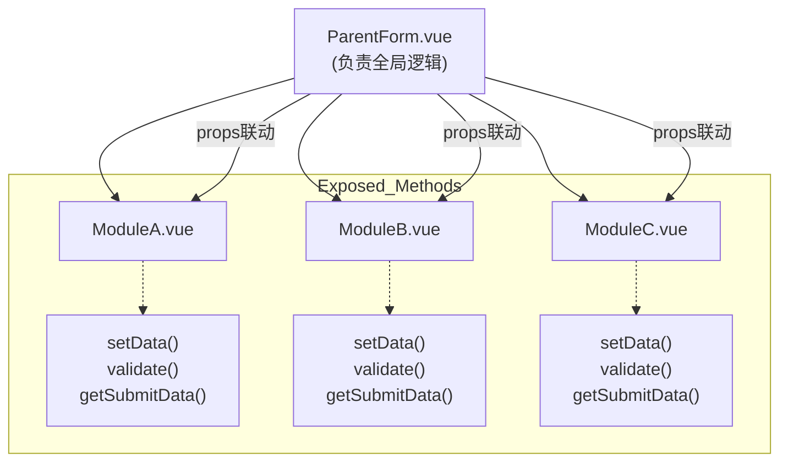
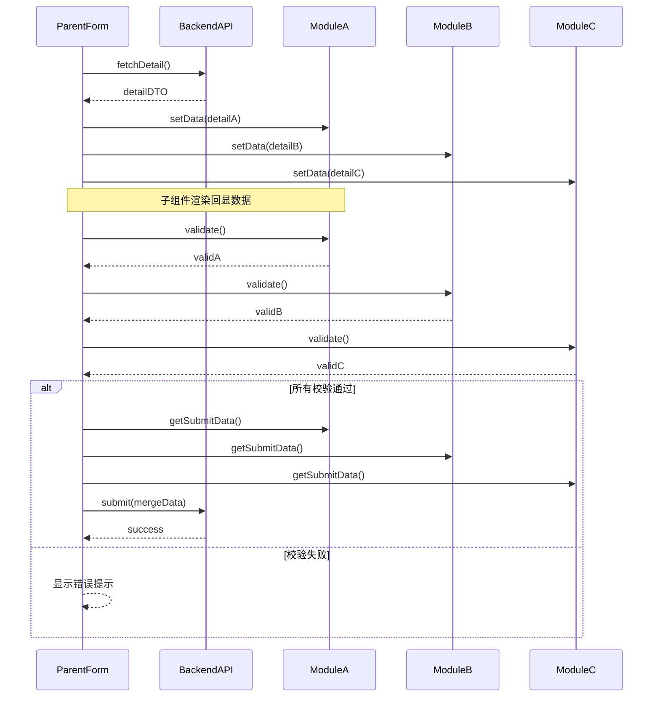

# 复杂大型表单模块化方案

> 本文总结了在多人协作场景下，将大型/复杂表单拆解为多个子模块组件的完整落地方案，涵盖“回显-渲染-校验-提交”全链路，并以 Mermaid 图展示整体架构与数据流。

---

## 一、核心思路

1. **父组件职责**
   * 统一拉取/提交接口数据。
   * 保存全局只读状态（如订单 ID、用户 ID 等）。
   * 通过 `ref` 调用各子组件暴露的方法：
     * `setData(detailFragment)` → 回显。
     * `validate()` → 返回 `boolean | { valid: boolean; message?: string }`。
     * `getSubmitData()` → 返回格式化后的片段数据。
   * 汇总校验结果、合并数据后调用保存接口。

2. **子组件职责**
   * 内部维护与渲染强相关的本地状态，避免泄漏实现细节。
   * 通过 `defineExpose`（Vue 3）或 `$refs`（Vue 2）暴露三类方法：`setData`、`validate`、`getSubmitData`。
   * 若依赖其它模块数据，由父组件以 `props` 透传，并在 `watch` 中监听。

3. **通信协议**

   ```text
   detailDTO  →  parent.parseDetail()  →  child.setData()
   (点击“保存”) parent.loop(child.validate()) → child.getSubmitData() → parent.merge → API
   ```

---

## 二、接口 & 代码示例

### 2.1 父组件（选段）

```vue
<script setup>
import { ref } from 'vue';
import api from '@/api/form';

const formA = ref(null);
const formB = ref(null);
const formC = ref(null);

const loadDetail = async () => {
  const dto = await api.fetchDetail();
  formA.value.setData(dto.moduleA);
  formB.value.setData(dto.moduleB);
  formC.value.setData(dto.moduleC);
};

const onSubmit = async () => {
  const forms = [formA.value, formB.value, formC.value];
  const allValid = (await Promise.all(forms.map(f => f.validate()))).every(Boolean);
  if (!allValid) return;

  const payload = Object.assign({}, ...forms.map(f => f.getSubmitData()));
  await api.save(payload);
};
</script>
```

### 2.2 子组件（选段）

```vue
<script setup>
import { defineExpose, reactive } from 'vue';

const state = reactive({
  price: 0,
  count: 1,
});

function setData(dto) {
  state.price = dto.price;
  state.count = dto.count;
}

function validate() {
  if (state.price <= 0) {
    // 亦可返回详细错误对象
    return false;
  }
  return true;
}

function getSubmitData() {
  return {
    price: Number(state.price),
    count: Number(state.count),
  };
}

defineExpose({ setData, validate, getSubmitData });
</script>
```

---

## 三、推荐实践要点

| 维度 | 建议 |
| :-- | :-- |
| 类型约束 | 在 `types.ts` 为每个子模块声明 **DTO** 与 **Form** 类型，父组件合并时获得良好类型推断。 |
| 校验方案 | 轻量场景用 `async-validator`；重度场景集中到父组件用 `yup` / `zod` 合并 schema；或子组件内部自校验。 |
| 联动逻辑 | 被依赖字段置于父组件作为 *source of truth*；通过 `computed` + `watch` 在子组件派生副作用，避免双向绑定陷阱。 |
| 渲染优化 | 模块多时使用 `keep-alive` 或 `v-show` 控制可见性；超大表单考虑虚拟列表或懒加载子模块。 |
| 插槽扩展 | 通过 `#extra`、`#footer` 等插槽，为特殊需求留扩展点，无需改动源码。 |

---

## 四、架构图

### 图 1：组件层级与暴露方法



### 图 2：回显-校验-提交时序



---

### 结语
以上即为复杂大型表单的模块化完整实践方案，如需进一步的类型定义、性能调优或联动示例，可随时交流。 