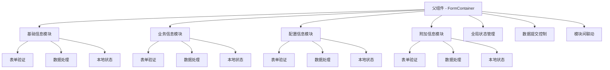
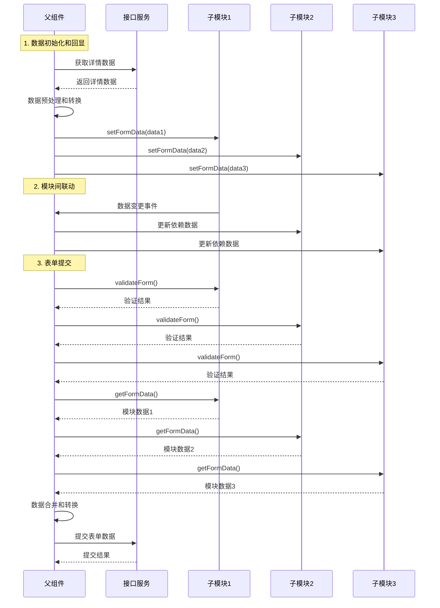

# 复杂表单模块架构设计方案

## 概述

在大型前端应用中，复杂表单往往包含多个模块，每个模块具有独立的业务逻辑和数据处理需求。为了提高代码的可维护性、可复用性和开发效率，本方案提出了一套基于Vue.js的复杂表单组件化架构设计。

## 核心设计思想

### 1. 职责分离
- **父组件职责**：数据协调、全局状态管理、表单提交与校验
- **子组件职责**：模块内部逻辑、数据处理、局部状态管理

### 2. 数据流设计
- **单向数据流**：父组件控制数据分发
- **统一接口**：标准化的数据设置和获取方法
- **响应式联动**：支持模块间的数据依赖关系

## 架构设计图

### 组件关系结构图



### 数据流时序图



## 子组件设计规范

### 1. 基础接口规范

每个子模块组件必须实现以下标准接口：

```javascript
// 子组件必须提供的方法
export default {
  methods: {
    // 设置表单数据（用于回显）
    setFormData(data) {
      // 将外部数据转换为组件内部格式
    },
    
    // 获取表单数据（用于提交）
    getFormData() {
      // 将组件内部数据转换为接口格式
      return this.formatFormData();
    },
    
    // 表单校验
    validateForm() {
      // 返回校验结果
      return {
        valid: boolean,
        errors: []
      };
    },
    
    // 重置表单
    resetForm() {
      // 重置到初始状态
    }
  }
}
```

### 2. Props设计规范

```javascript
props: {
  // 基础配置
  mode: {
    type: String,
    default: 'edit', // edit | view | create
    validator: val => ['edit', 'view', 'create'].includes(val)
  },
  
  // 依赖数据（来自其他模块）
  dependencyData: {
    type: Object,
    default: () => ({})
  },
  
  // 配置选项
  options: {
    type: Object,
    default: () => ({})
  },
  
  // 禁用状态
  disabled: {
    type: Boolean,
    default: false
  }
}
```

### 3. 事件规范

```javascript
// 子组件向父组件发送的标准事件
this.$emit('data-change', {
  module: 'basicInfo',
  data: this.formData,
  field: 'specificField', // 具体变更的字段
  oldValue: oldVal,
  newValue: newVal
});

this.$emit('validation-change', {
  module: 'basicInfo',
  valid: true,
  errors: []
});
```

## 父组件设计规范

### 1. 数据管理

```javascript
data() {
  return {
    // 全局表单数据
    formData: {},
    
    // 各模块验证状态
    validationStatus: {
      basicInfo: { valid: true, errors: [] },
      businessInfo: { valid: true, errors: [] },
      configInfo: { valid: true, errors: [] }
    },
    
    // 模块间依赖关系配置
    dependencies: {
      businessInfo: ['basicInfo.productType'],
      configInfo: ['basicInfo.category', 'businessInfo.type']
    }
  }
}
```

### 2. 核心方法

```javascript
methods: {
  // 初始化表单数据
  async initFormData() {
    const data = await this.fetchDetailData();
    this.distributeDataToModules(data);
  },
  
  // 分发数据到各模块
  distributeDataToModules(data) {
    Object.keys(this.$refs).forEach(refKey => {
      if (this.$refs[refKey].setFormData) {
        const moduleData = this.transformDataForModule(refKey, data);
        this.$refs[refKey].setFormData(moduleData);
      }
    });
  },
  
  // 收集所有模块数据
  async collectFormData() {
    const moduleData = {};
    
    for (const refKey of Object.keys(this.$refs)) {
      if (this.$refs[refKey].getFormData) {
        moduleData[refKey] = await this.$refs[refKey].getFormData();
      }
    }
    
    return this.transformDataForSubmit(moduleData);
  },
  
  // 全局表单验证
  async validateAllModules() {
    const validationResults = {};
    let globalValid = true;
    
    for (const refKey of Object.keys(this.$refs)) {
      if (this.$refs[refKey].validateForm) {
        const result = await this.$refs[refKey].validateForm();
        validationResults[refKey] = result;
        if (!result.valid) {
          globalValid = false;
        }
      }
    }
    
    this.validationStatus = validationResults;
    return { valid: globalValid, modules: validationResults };
  },
  
  // 处理模块间联动
  handleModuleDependency(changedModule, changedField) {
    Object.keys(this.dependencies).forEach(targetModule => {
      const deps = this.dependencies[targetModule];
      const affectedDep = deps.find(dep => dep.startsWith(\`\${changedModule}.\`));
      
      if (affectedDep) {
        const dependencyData = this.extractDependencyData(deps);
        this.$refs[targetModule].updateDependencyData(dependencyData);
      }
    });
  }
}
```

## 最佳实践

### 1. 数据转换策略

```javascript
// 数据转换器模式
class FormDataTransformer {
  // 接口数据 -> 组件数据
  static toComponentFormat(apiData, moduleType) {
    const transformers = {
      basicInfo: (data) => ({
        name: data.productName || '',
        type: data.productType || 1,
        description: data.description || ''
      }),
      
      businessInfo: (data) => ({
        price: data.saleInfo?.price || 0,
        inventory: data.saleInfo?.stock || 0
      })
    };
    
    return transformers[moduleType]?.(apiData) || {};
  }
  
  // 组件数据 -> 接口数据
  static toApiFormat(componentData) {
    return {
      productName: componentData.basicInfo?.name,
      productType: componentData.basicInfo?.type,
      saleInfo: {
        price: componentData.businessInfo?.price,
        stock: componentData.businessInfo?.inventory
      }
    };
  }
}
```

### 2. 错误处理机制

```javascript
// 统一错误处理
class FormErrorHandler {
  static handleValidationError(errors, moduleRef) {
    // 显示错误信息
    errors.forEach(error => {
      if (error.field && moduleRef.$refs[error.field]) {
        moduleRef.$refs[error.field].showError(error.message);
      }
    });
  }
  
  static handleSubmitError(error, context) {
    if (error.code === 'VALIDATION_FAILED') {
      // 处理验证失败
      Object.keys(error.details).forEach(module => {
        context.$refs[module]?.showErrors(error.details[module]);
      });
    } else {
      // 处理其他错误
      context.$message.error(error.message || '提交失败');
    }
  }
}
```

### 3. 性能优化

```javascript
// 防抖处理模块间联动
const debouncedDependencyUpdate = debounce((module, field, value) => {
  this.handleModuleDependency(module, field, value);
}, 300);

// 懒加载子组件
const AsyncFormModule = () => ({
  component: import('./FormModule.vue'),
  loading: LoadingComponent,
  error: ErrorComponent,
  delay: 200,
  timeout: 3000
});
```

### 4. 类型安全

```typescript
// TypeScript 接口定义
interface FormModuleInterface {
  setFormData(data: any): void;
  getFormData(): Promise<any>;
  validateForm(): Promise<ValidationResult>;
  resetForm(): void;
}

interface ValidationResult {
  valid: boolean;
  errors: FormError[];
}

interface FormError {
  field: string;
  message: string;
  code?: string;
}
```

## 状态管理方案

### 1. Vuex集成

```javascript
// store/modules/complexForm.js
const state = {
  formData: {},
  validationStatus: {},
  isSubmitting: false,
  isDirty: false
};

const mutations = {
  SET_FORM_DATA(state, { module, data }) {
    Vue.set(state.formData, module, data);
    state.isDirty = true;
  },
  
  SET_VALIDATION_STATUS(state, { module, status }) {
    Vue.set(state.validationStatus, module, status);
  },
  
  RESET_FORM(state) {
    state.formData = {};
    state.validationStatus = {};
    state.isDirty = false;
  }
};

const actions = {
  async saveFormData({ commit, state }) {
    commit('SET_SUBMITTING', true);
    try {
      const result = await api.saveForm(state.formData);
      commit('RESET_FORM');
      return result;
    } finally {
      commit('SET_SUBMITTING', false);
    }
  }
};
```

### 2. 组合式API方案（Vue 3）

```javascript
// composables/useComplexForm.js
import { ref, reactive, computed } from 'vue';

export function useComplexForm() {
  const formData = reactive({});
  const validationStatus = reactive({});
  const isSubmitting = ref(false);
  
  const isFormValid = computed(() => {
    return Object.values(validationStatus).every(status => status.valid);
  });
  
  const setModuleData = (module, data) => {
    formData[module] = data;
  };
  
  const setModuleValidation = (module, status) => {
    validationStatus[module] = status;
  };
  
  return {
    formData,
    validationStatus,
    isSubmitting,
    isFormValid,
    setModuleData,
    setModuleValidation
  };
}
```

## 测试策略

### 1. 单元测试

```javascript
// 子组件测试
describe('BasicInfoModule', () => {
  let wrapper;
  
  beforeEach(() => {
    wrapper = mount(BasicInfoModule);
  });
  
  it('should set form data correctly', async () => {
    const testData = { name: 'Test Product', type: 1 };
    await wrapper.vm.setFormData(testData);
    
    expect(wrapper.vm.formData.name).toBe('Test Product');
    expect(wrapper.vm.formData.type).toBe(1);
  });
  
  it('should validate form correctly', async () => {
    wrapper.vm.formData = { name: '', type: null };
    const result = await wrapper.vm.validateForm();
    
    expect(result.valid).toBe(false);
    expect(result.errors).toHaveLength(2);
  });
});
```

### 2. 集成测试

```javascript
// 父子组件集成测试
describe('ComplexForm Integration', () => {
  it('should handle module dependency correctly', async () => {
    const wrapper = mount(ComplexForm);
    
    // 触发基础信息模块的变更
    await wrapper.vm.$refs.basicInfo.updateField('type', 'premium');
    
    // 验证依赖模块是否正确更新
    expect(wrapper.vm.$refs.businessInfo.dependencyData.productType)
      .toBe('premium');
  });
});
```

## 总结

本架构方案通过组件化设计、标准接口规范、数据流管理等方式，有效解决了复杂表单的开发和维护问题。主要优势包括：

1. **高内聚低耦合**：每个子模块独立管理自己的逻辑
2. **易于维护**：标准化的接口让代码更加规范
3. **便于测试**：组件化设计便于单元测试和集成测试
4. **支持复用**：子模块可以在不同表单中复用
5. **扩展性强**：新增模块只需遵循接口规范即可

通过这套方案，团队可以更高效地开发和维护复杂的表单应用，提高代码质量和开发效率。 